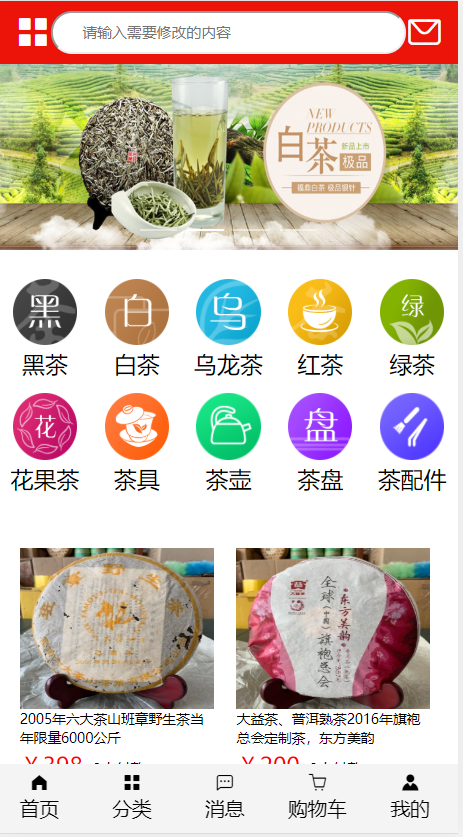
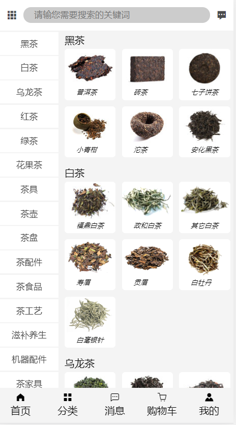
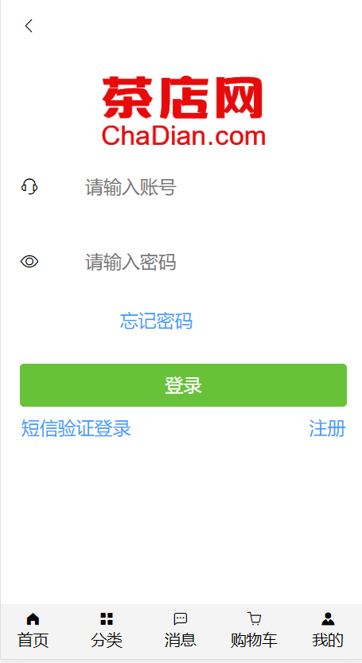
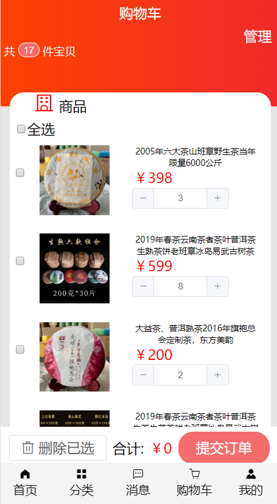

## 项目名称：茶店网
* 演示
	* 官网地址：(https://m.chadian.com/)
	* 上线网址：(http://116.62.5.240/home)
	* 客户端账号：xiaoxie 密码:123456
	* 管理系统账号：xiaoxie 密码：123456
* git仓库地址：
* 团队与分工
    * 格式：组长：李海，成员：覃宁,张晓旭，龙利成
    * 负责模块说明
		* 李海：首页模块
		* 覃宁：登录注册和个人信息页模块
		* 张晓旭：列表页和详情页模块
		* 龙利成：购物车页模块
* 项目页面截图

* 项目目录说明
src
    │  App.vue-------------------------------------------------------------茶店网
    │  main.js---------------------------------------------------------------引用全局配置
    │
    ├─assets----------------------------------------------------------------资源存放文件夹
    │ 
    ├─components
    │  └─footer
    │          footer.vue-----------------------------------------------------底部模块
    │
    ├─pages
    │      cart.vue------------------------------------------------------------购物车模页
    │      goods.vue---------------------------------------------------------二级列表页
    │      home.vue---------------------------------------------------------首页
    │      list.vue-------------------------------------------------------------一级列表页
    │      login.vue----------------------------------------------------------登陆页
    │      mine.vue----------------------------------------------------------个人信息页面
    │      news.vue----------------------------------------------------------消息页
    │      not.vue-------------------------------------------------------------404报错页面
    │      order.vue----------------------------------------------------------订单页
    │      reg.vue-------------------------------------------------------------登录页
    │      usermsg.vue-----------------------------------------------------个人信息设置
    │      xiang.vue----------------------------------------------------------详情页
    │
    ├─router-----------------------------------------------------------------路由文件夹
    │      index.js------------------------------------------------------------路由配置
    │
    ├─static-----------------------------------------------------------------资源文件夹
    │
    └─store
            cart.js--------------------------------------------------------------vuex路由模块
            common.js-------------------------------------------------------vuex登录注册模块
            index.js-----------------------------------------------------------vuex首页
